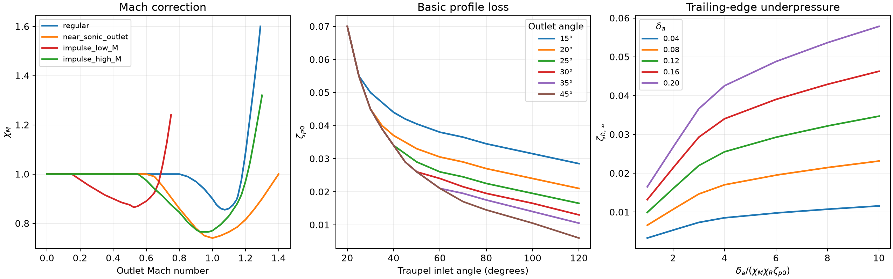
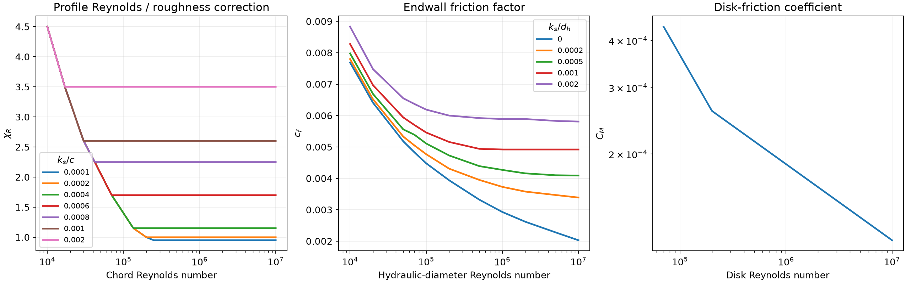
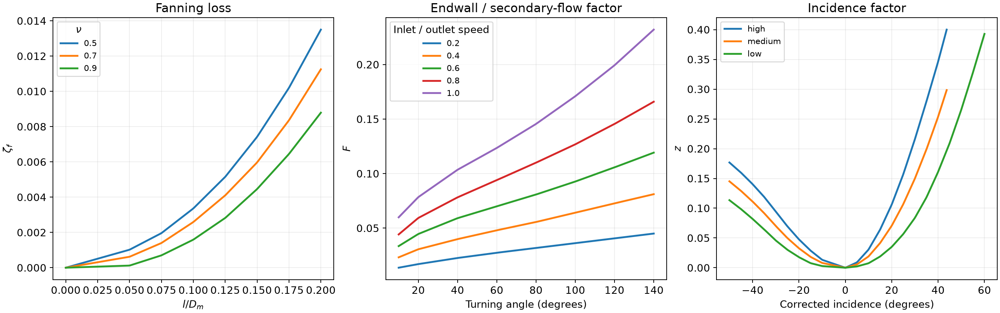
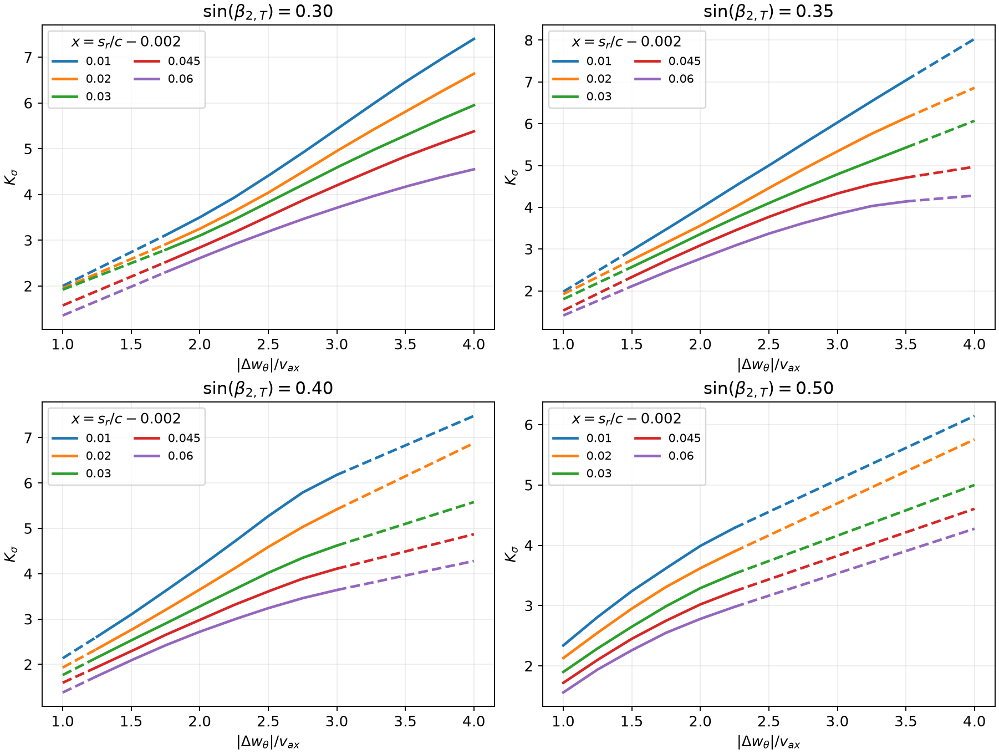
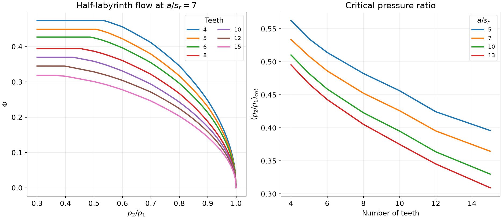

# RocketTurbines

## Introduction

Hi,

Welcome to RocketTurbines, a Python library for sizing and meanline analysis of axial turbines. It was created with
supersonic rocket turbines in mind, including impulse stages and partial admission, but can also be used for subsonic
stages. It calculates turbine dimensions, nonisentropic flow states, velocities, flow angles and losses from the
specified design-point requirements. I hope you will find it useful.

With kind regards, Jan

## General Overview

RocketTurbines sizes a single stator-and-rotor stage from prescribed shaft power, mass flow, speed, loading, flow
coefficient and isentropic reaction. The stage state and its empirical losses are coupled: a numerical solver finds
entropy rises that agree with the losses calculated for the resulting flow and geometry.

The repository is organised as follows:

- `RocketTurbines/Turbine1D.py` defines the `Turbine1D` stage, sizing procedure, thermodynamic calculations and geometry.
- `RocketTurbines/TraupelLossModel.py` defines `TraupelLossModel`, its digitised empirical coefficients and loss methods.
- `RocketTurbines/IdealGas.py` defines the `IdealGas` mixture properties used by the turbine and loss model.
- `RocketTurbines/example.py` demonstrates sizing a partial-admission impulse turbine with a water-vapour/oxygen mixture.
- `docs/figures/` contains the empirical-coefficient plots shown below. `docs/plot_traupel_coefficients.py` regenerates
  them directly from `TraupelLossModel` with Matplotlib.
- `setup.py` installs the three class modules, and `LICENSE` contains the GNU General Public License version 3.

The current public stage workflow is design-point sizing. Results are stored in the turbine object; an independent
off-design stage-analysis or performance-map method is not implemented.

All dimensional inputs and outputs use SI units. Pressures are in Pa, temperatures in K, mass flow in kg/s, shaft
power in W, lengths in m, specific enthalpy in J/kg and specific entropy in J/(kg K). Rotational speed is in RPM.
Flow angles are in radians unless an argument or result explicitly uses degrees.

## Installation

Python 3.11 or newer is required. Install the library directly from GitHub:

```text
pip3 install git+https://github.com/janstruzinski/RocketTurbines
```

The installation includes NumPy, SciPy, CoolProp and ThermoProp. The module imports follow the same style as DynamicPumps:

```python
from Turbine1D import Turbine1D
from TraupelLossModel import TraupelLossModel
from IdealGas import IdealGas
```

To run the supplied example from a checkout:

```text
python RocketTurbines/example.py
```

To regenerate the README figures, also install Matplotlib and run:

```text
pip3 install matplotlib
python docs/plot_traupel_coefficients.py
```

## Disclaimer

This library is intended for preliminary turbine sizing and engineering analysis. The empirical correlations and
meanline assumptions should be checked for the particular design. LLM was used for the generation of this README.

## Documentation

### Turbine1D

`Turbine1D` in `RocketTurbines/Turbine1D.py` represents a steady, one-dimensional, nonisentropic axial turbine stage.
Its principal workflow is:

1. Construct an `IdealGas` mixture and a `TraupelLossModel` object.
2. Construct an empty `Turbine1D` object.
3. Call `size_turbine(...)` with the required shaft power, flow conditions, stage coefficients and geometry inputs.
4. Read the geometry attributes and the three stored design-point result dictionaries.

#### Assumptions and nomenclature

The model uses a calorically perfect ideal gas, negligible inlet velocity, equal flow areas at stations 1 and 2 and
a constant Euler diameter. Rotor axial width is taken equal to its chord. Geometry is represented at the meanline;
the code calculates flow angles rather than blade metal angles or detailed blade profiles.

Station 0 is before the stator, station 1 is between the stator and rotor, and station 2 is after the rotor. In the
equations below, $v$ is absolute velocity, $w$ is rotor-relative velocity, $u$ is blade speed, $h$ is static enthalpy,
and $h_t=h+v^2/2$ is absolute total enthalpy. The result names use `_t` for total properties, `_s` and `_r` for
stationary and rotating reference frames, `_ideal` for isentropic reference quantities, and `_tt`, `_ts` and `_ss`
for total-to-total, total-to-static and static-to-static quantities. `_ideal_r_real_s` means isentropic rotor expansion
following the actual stator state.

Angles in the turbine results are measured from the axial/meridional direction. The `_blade` results describe the
rotor passage with its aerodynamic losses at the same outlet static pressure as the complete stage. They supply the
local cascade flow needed by the loss correlations.

#### Design-point quantities and geometry

`size_turbine(...)` takes `gas`, `work_coefficient_tt`, `flow_coefficient`, `reaction_isentropic_tt`, `RPM`,
`shaft_power`, `mdot`, `T_0`, `p_0` and a `loss_model`. The specified loading is the real shaft-work coefficient;
the specified flow coefficient is based on the rotor outlet axial velocity:

$$
\Delta h_t=\frac{P_{\mathrm{shaft}}}{\dot{m}}, \qquad
\psi_{tt}=\frac{\Delta h_t}{u^2}, \qquad
\theta_2=\frac{v_{ax,2}}{u}.
$$

The speed and Euler diameter follow directly:

$$
u=\sqrt{\frac{\Delta h_t}{\psi_{tt}}}, \qquad
\omega=\frac{2\pi N}{60}, \qquad D_E=\frac{2u}{\omega}.
$$

Here $N$ is `RPM`. Inlet and prescribed outlet total enthalpies are

$$
h_{t0}=c_pT_0, \qquad h_{t2}=h_{t0}-\Delta h_t.
$$

`reaction_isentropic_tt` is the rotor static enthalpy drop divided by the stage total-to-total enthalpy drop in the
fully isentropic reference stage:

$$
R_{h,tt,\mathrm{ideal}}=
\frac{h_{1,\mathrm{ideal}}-h_{2,\mathrm{ideal}}}
{h_{t0}-h_{t2,\mathrm{ideal}}}.
$$

The remaining inputs prescribe radial clearance, stator and rotor blade counts, chord-to-pitch ratios, trailing-edge
thickness and surface roughness. For admission fraction $\varepsilon$, stator count $n_s$ within the admitted arc and
rotor count $n_r$ around the full circumference,

$$
p_s=\frac{\varepsilon\pi D_E}{n_s}, \qquad p_r=\frac{\pi D_E}{n_r}, \qquad
c_s=(c/p)_s p_s, \qquad c_r=(c/p)_r p_r.
$$

`t_TE_stator` and `t_TE_rotor` are the circumferential projections of trailing-edge thickness. The axial row gap is
`s_ax_over_pitch_rotor` times rotor pitch. Equivalent sand roughness is $k_s=5.863R_a$.

Once the flow solution determines outlet density, the full annulus area and diameters are

$$
A=\frac{\dot{m}}{\varepsilon\rho_2\theta_2u}, \qquad
D_h=\sqrt{D_E^2-\frac{2A}{\pi}}, \qquad D_t=\sqrt{D_E^2+\frac{2A}{\pi}}.
$$

$$
D_m=\frac{D_h+D_t}{2}, \qquad l=\frac{D_t-D_h}{2}.
$$

The stator and rotor have the same radial blade length. A shrouded rotor additionally uses
`h_shroud_over_blade_length`, `s_ax_shroud_over_h_shroud` and `seal_teeth_number`; the seal requires an integer count
greater than two. Tooth spacing is $c_r/(n_{\mathrm{teeth}}-1)$. `t_shroud` stores an optional supplied shroud thickness.

#### Sizing logic and numerical solution

The following diagram is reproduced from the comments in `Turbine1D.__init__`:

```text
 Turbine1D.size_turbine
   |
   +--> OUTER LOOP ---------------------------------------------------------------+
   |      Vary: stator, rotor aerodynamic and additional rotor entropy rises      |
   |      Residuals: calculated minus assumed entropy rise for each loss group   |
   |      |                                                                       |
   |      v                                                                       |
   |    Turbine1D.calculate_entropy_rise                                          |
   |      |                                                                       |
   |      +--> INNER LOOP -------------------------------------------+            |
   |      |      Vary: h_2/h_t0                                      |            |
   |      |      Residual: calculated minus prescribed outlet        |            |
   |      |                total enthalpy, divided by h_t0           |            |
   |      |      |                                                   |            |
   |      |      v                                                   |            |
   |      |    Turbine1D.__calculate_thermodynamic_properties --------+            |
   |      |                                                                       |
   |      v  (after inner loop converges)                                         |
   |    Analysis results: station states and absolute rotor outlet velocity       |
   |      |                                                                       |
   |      v                                                                       |
   |    Turbine1D.__calculate_blade_rows_outlet_velocities                         |
   |      |                                                                       |
   |      v                                                                       |
   |    Updated analysis results: outlet velocities, Mach and Reynolds numbers    |
   |      |                                                                       |
   |      v                                                                       |
   |    Turbine1D.__calculate_flow_angles                                          |
   |      |                                                                       |
   |      v                                                                       |
   |    Analysis results with flow angles                                         |
   |      |                                                                       |
   |      v                                                                       |
   |    Turbine1D.__calculate_blade_row_velocities                                 |
   |      Prescribed: stage outlet static pressure and aerodynamic entropy rise   |
   |      |                                                                       |
   |      v                                                                       |
   |    Blade-row results: states, velocities and flow angles                       |
   |      |                                                                       |
   |      v                                                                       |
   |    Turbine1D.__calculate_geometry                                             |
   |      |                                                                       |
   |      v                                                                       |
   |    Turbine geometry, together with analysis and blade-row results             |
   |      |                                                                       |
   |      v                                                                       |
   |    TraupelLossModel.calculate_entropy_increase                                 |
   |      |                                                                       |
   |      v                                                                       |
   |    Calculated entropy rises and loss results                                  |
   |      |                                                                       |
   |      +--> Calculate entropy-rise residuals ----------------------------------+
   |
   v  (after outer loop converges)
 Consistent entropy rises, analysis results, blade-row results and loss results
   |
   v
 Turbine1D.__calculate_geometry
   |
   v
 Sized turbine geometry and stored design-point results
```

The outer unknowns are the stator aerodynamic, rotor aerodynamic and additional rotor entropy rises:

$$
\mathbf{x}=[\Delta s_s,\;\Delta s_r,\;\Delta s_{r,\mathrm{additional}}], \qquad
\mathbf{r}=\mathbf{x}_{\mathrm{loss\ model}}-\mathbf{x}.
$$

SciPy's bounded `least_squares()` uses `dogbox` and a two-point numerical Jacobian. `delta_s_estimate` supplies three
nonnegative initial estimates. Its default `[0, 0, 0]` is replaced by the loss-model estimate evaluated at zero entropy
rise. At the accepted solution, each dimensional entropy residual must be below $10^{-4}$ J/(kg K) in absolute value.

During each outer evaluation, an inner solve varies $h_2/h_{t0}$ to satisfy

$$
r_h=\frac{h_2+v_2^2/2-h_{t2}}{h_{t0}}=0.
$$

The inner solver uses TOMS 748 with a verified bracket, or a Newton fallback when necessary. The ideal-gas entropy
relation determines pressures from the assumed entropy rises and static temperatures:

$$
\Delta s=c_p\ln\left(\frac{T_{\mathrm{out}}}{T_{\mathrm{in}}}\right)
-R\ln\left(\frac{p_{\mathrm{out}}}{p_{\mathrm{in}}}\right).
$$

For example, with the sum of all three entropy rises denoted by $\Delta s_{\mathrm{stage}}$,

$$
p_2=p_0\exp\left(-\frac{\Delta s_{\mathrm{stage}}}{R}\right)
\left(\frac{h_2}{h_{t0}}\right)^{c_p/R}.
$$

Equal-area continuity gives $\theta_1=\theta_2\rho_2/\rho_1$. The prescribed isentropic reaction determines the
intermediate state, while the real reaction $R_{h,tt}=(h_1-h_2)/\Delta h_t$ enters the velocity triangles. Define
$d_\theta=(\theta_2^2-\theta_1^2)/(2\psi_{tt})$. The circumferential velocities are

$$
\frac{v_{\theta,1}}{u}=1-R_{h,tt}+\frac{\psi_{tt}}{2}+d_\theta, \qquad
\frac{v_{\theta,2}}{u}=1-R_{h,tt}-\frac{\psi_{tt}}{2}+d_\theta.
$$

Relative velocities have $w_\theta=v_\theta-u$. Flow angles use `atan2(circumferential velocity, axial velocity)`.
The local rotor-passage solution retains only aerodynamic rotor entropy rise at the prescribed stage outlet pressure;
continuity and constant-radius rothalpy determine its outlet velocities. Geometry and losses are then recalculated
before the entropy residuals are returned.

#### Stored results and efficiencies

`size_turbine(...)` updates the object and returns `None`. Geometry is available as `D_Euler`, `D_hub`, `D_tip`,
`D_mean`, `l_stator`, `l_rotor`, `p_stator`, `p_rotor`, `c_stator`, `c_rotor`, `s_ax`, `s_r` and the shroud attributes.
The result dictionaries are:

- `analysis_results_at_design_point`: complete stage states, velocities, Mach and Reynolds numbers, flow angles,
  loading, reaction, pressure ratio, entropy rises, shaft power and efficiencies.
- `blade_row_results_at_design_point`: local rotor-passage states, velocities, flow angles and associated coefficients.
- `loss_model_results_at_design_point`: aerodynamic and incidence loss coefficients, disk friction, clearance,
  admission, dissipated enthalpies, entropy rises and shroud leakage flow.

The reported efficiencies use the exact isentropic enthalpy drops at the corresponding outlet total or static
pressure. With $\Delta s_{\mathrm{stage}}$ denoting total stage entropy rise, the ideal reference enthalpies are

$$
h_{t2,\mathrm{ideal}}=h_{t2}\exp\left(-\frac{\Delta s_{\mathrm{stage}}}{c_p}\right), \qquad
h_{2,\mathrm{ideal}}=h_2\exp\left(-\frac{\Delta s_{\mathrm{stage}}}{c_p}\right).
$$

The efficiencies are

$$
\eta_{tt}=\frac{\Delta h_t}{h_{t0}-h_{t2,\mathrm{ideal}}}, \qquad
\eta_{ts}=\frac{\Delta h_t}{h_{t0}-h_{2,\mathrm{ideal}}}.
$$

`psi_tt_ideal` uses the same total-to-total isentropic enthalpy drop. `zeta_stator_Denton` and `zeta_rotor_Denton` are
entropy-based diagnostic loss
coefficients and use a different normalisation from Traupel's coefficients below.

`calculate_entropy_rise(...)` is also public. After sizing inputs have been assigned, it evaluates a trial set of
entropy rises and returns `(residuals, analysis_results, blade_row_results, loss_model_results)`.

### TraupelLossModel

`TraupelLossModel` in `RocketTurbines/TraupelLossModel.py` implements empirical turbine-loss correlations from
Walter Traupel's *Thermische Turbomaschinen*, Volume I. It separates aerodynamic passage losses from clearance,
disk-friction and partial-admission losses. The equations below describe the implemented relations, including their
numerical approximations. All empirical plots are redrawn directly from the coefficient data and interpolators in
the class, so the reader can inspect the values used by the library here.

#### Configuration and coefficient interpolation

Construct the model with `extrapolation_method="closest"` or `"linear"`. `"closest"` clips each input coordinate to
the digitised grid boundary; `"linear"` extends the interpolator in its interpolation coordinates. Reynolds-number
axes are logarithmic for $\chi_R$ and $c_f$, and both axes are logarithmic for $C_M$.
`warn_on_extrapolation=True` emits a warning for every out-of-bounds coefficient evaluation.

The other constructor options are:

| Argument | Values | Meaning |
| --- | --- | --- |
| `incidence_loss` | `"high"`, `"medium"`, `"low"` | Upper curve, average of the two curves, or lower curve. Default: `"medium"`. |
| `stator` | `"regular"`, `"near_sonic_outlet"` | Mach correction for an accelerating cascade. Default: `"regular"`. |
| `rotor` | `"regular"`, `"near_sonic_outlet"`, `"impulse_low_M"`, `"impulse_high_M"` | Accelerating or impulse-rotor Mach correction. Default: `"regular"`. |

The impulse options also select the corresponding endwall and free-rotor partial-admission coefficients.
`"impulse_low_M"` represents a rounded leading edge; `"impulse_high_M"` represents a sharp leading edge.

The principal digitised ranges are:

| Coefficient | Input coordinates and grid limits |
| --- | --- |
| $\chi_R$ | $Re=10^4$ to $10^7$; $k_s/c=10^{-4}$ to $2\times10^{-3}$ |
| $\chi_M$ | Regular: $M=0$ to 1.30; near-sonic: 0.65 to 1.40; low-M impulse: 0.15 to 0.75; high-M impulse: 0.65 to 1.30 |
| $\zeta_{p0}$ | Traupel inlet angle: 20 to 120 degrees; outlet angle: 15 to 45 degrees |
| $\zeta_{h,\infty}$ | $\delta_a/(\chi_M\chi_R\zeta_{p0})=1$ to 10; $\delta_a=0.04$ to 0.20 |
| $\zeta_f$ | $l/D_m=0$ to 0.20; $\nu=0.5$ to 0.9 |
| $F$ | Turning: 10 to 140 degrees; inlet/outlet speed ratio: 0.2 to 1.0 |
| $c_f$ | $Re=10^4$ to $10^7$; $k_s/d_h=0$ to $2\times10^{-3}$ |
| $K_\sigma$ | Sine of outlet angle: 0.30 to 0.50; velocity-change ratio: 1 to 4; normalised clearance: 0.01 to 0.06 |
| $C_M$ | Disk Reynolds number: $7\times10^4$ to $10^7$ |
| $z$ | High curve: -50 to +43.7 degrees; low curve: -50 to +60 degrees |
| $\Phi^2$ | $p_2/p_1=0.3$ to 1; tooth spacing/clearance: 5 to 13; teeth: 4 to 15 |

These are lookup ranges, rather than validation of a turbine design. For example, the stator uses zero inlet/outlet
speed ratio for $F$, which is outside that graph's digitised range and therefore uses the configured boundary rule.
The $K_\sigma$ grid includes prepared extensions described below. Negative interpolated coefficients are floored at
zero; $\zeta_{p0}$ has a floor of 0.001 because it appears in denominators.

#### Loss definitions and angle convention

For a blade row, the aerodynamic-plus-incidence coefficient is defined by the dissipated static enthalpy divided
by ideal outlet kinetic energy. Let $q$ denote stator absolute or rotor-relative outlet speed. Then

$$
\zeta_{\mathrm{row}}=\frac{\Delta h_{\mathrm{loss,row}}}{q_{\mathrm{ideal}}^2/2}, \qquad
\eta_{\mathrm{row}}=1-\zeta_{\mathrm{row}}, \qquad
\Delta h_{\mathrm{loss,row}}=\frac{\zeta_{\mathrm{row}}}{1-\zeta_{\mathrm{row}}}\frac{q^2}{2}.
$$

Additional-loss coefficients instead use the stage static-to-static isentropic enthalpy drop:

$$
\zeta_{\mathrm{additional}}=
\frac{\Delta h_{\mathrm{loss,additional}}}{\Delta h_{\mathrm{ideal,ss}}}, \qquad
\psi_{ss,\mathrm{ideal}}=\frac{\Delta h_{\mathrm{ideal,ss}}}{u^2}.
$$

Traupel measures stator outlet and rotor inlet angles from the positive circumferential direction, and rotor outlet
angle from the negative circumferential direction. The turbine-to-loss-model conversion is

$$
\alpha_{1,T}=\frac{\pi}{2}-\alpha_1, \qquad
\beta_{1,T}=\frac{\pi}{2}-\beta_1, \qquad
\beta_{2,T}=\frac{\pi}{2}+\beta_{2,\mathrm{blade}}.
$$

In the following blade-row equations, $a$ and $b$ are Traupel inlet and outlet angles, $c$ is chord, $l$ is radial
blade length, $p$ is pitch, $D_m$ is mean diameter, $k_s$ is equivalent sand roughness, and
$\delta_a=t_{TE}/p$ is the circumferential trailing-edge blockage. Direct calls to `calculate_zeta_p0()`,
`calculate_F()` and `calculate_z()` use degrees; the assembled loss methods take angles in radians.

#### Profile and trailing-edge losses

`calculate_blade_row_aerodynamic_loss(...)` first calculates

$$
\zeta_p=\chi_R\chi_M\zeta_{p0}+\zeta_h+\zeta_C, \qquad
\zeta_C=\left(\frac{\delta_a}{1-\delta_a}\right)^2\sin^2 b.
$$

$\chi_R$ accounts for Reynolds number and roughness, $\chi_M$ for outlet Mach number, $\zeta_{p0}$ for inlet and
outlet angles, $\zeta_h$ for trailing-edge underpressure, and $\zeta_C$ for trailing-edge mixing/blockage.



The trailing-edge plot shows the full-strength nomogram value $\zeta_{h,\infty}$. The code applies the following
Reynolds-number transition:

$$
\zeta_h=g(Re)\zeta_{h,\infty}, \qquad
g(Re)=\begin{cases}
0, & Re\leq8\times10^4,\\
\sqrt{1-\left(1-\dfrac{Re-8\times10^4}{7\times10^4}\right)^2},
& 8\times10^4<Re<1.5\times10^5,\\
1, & Re\geq1.5\times10^5.
\end{cases}
$$

The quarter-ellipse transition is an approximation used in this implementation. The following plots show the
profile roughness correction, endwall friction coefficient and disk-friction coefficient used by the model:



#### Fanning, endwall and secondary-flow losses

The fanning coefficient $\zeta_f$ depends on $l/D_m$ and speed parameter
$\nu=1/\sqrt{2\psi_{ss,\mathrm{ideal}}}$. Set $\bar\zeta_p=\zeta_p+\zeta_f$, $L=l/p$, and

$$
L_{\mathrm{crit}}=B\sqrt{\bar\zeta_p}, \qquad
B=\begin{cases}10,&\text{impulse rotor},\\7,&\text{accelerating cascade}.\end{cases}
$$

The residual endwall/secondary-flow loss is

$$
\zeta_{\mathrm{rest}}=\begin{cases}
\zeta_a+\dfrac{\zeta_p}{\zeta_{p0}}\dfrac{F}{L}, & L\geq L_{\mathrm{crit}},\\
\zeta_a+\dfrac{\zeta_p}{\zeta_{p0}}\dfrac{F}{L_{\mathrm{crit}}}
+A_c\dfrac{c}{p}\left(\dfrac{1}{L}-\dfrac{1}{L_{\mathrm{crit}}}\right), & L<L_{\mathrm{crit}}.
\end{cases}
$$

$A_c=0.035$ for an impulse rotor and 0.02 for an accelerating cascade. $F$ depends on turning angle
$180^\circ-a-b$ and inlet/outlet speed ratio. The complete aerodynamic row coefficient is

$$
\zeta_{\mathrm{aerodynamic}}=\zeta_p+\zeta_f+\zeta_{\mathrm{rest}}.
$$

For the unshrouded stator, with axial row gap $s_{ax}$ and hydraulic diameter $d_h=2l$,

$$
\zeta_a=\frac{c_f}{\sin b}\left(1+\frac{l}{D_m}\right)\frac{s_{ax}}{l}.
$$

The friction-factor Reynolds number is the chord Reynolds number multiplied by $2l/c$. For an unshrouded rotor,
$\zeta_a=0$. For a shrouded row with axial shroud gap $s_{ax,\mathrm{shroud}}$,

$$
\zeta_a=\frac{0.04}{\sin b}\frac{s_{ax,\mathrm{shroud}}}{l}.
$$



#### Incidence loss

`calculate_incidence_losses(...)` corrects the inlet-angle deviation $i$ for inlet Mach number before reading $z$:

$$
M_c=\min(0.8,\max(0.5,M_{\mathrm{in}})), \qquad
i_c=\frac{i}{2(1-M_c)}, \qquad
\zeta_{\mathrm{incidence}}=z(i_c)\left(\frac{q_{\mathrm{in}}}{q_{\mathrm{out}}}\right)^2.
$$

The incidence plot above shows `"high"`, `"medium"` and `"low"`. Medium is the average of the two interpolated curves;
each original curve retains its own bounds outside the displayed common range. In the current design-point sizing
workflow, both stator and rotor incidence are set to zero. The direct incidence-loss method accepts a prescribed
nonzero deviation when used separately.

#### Unshrouded rotor clearance

`calculate_unshrouded_rotor_clearance_loss(...)` uses the local rotor-passage velocities. Define radial clearance
$s_r$, Traupel reaction $R_T$, normalised inlet relative velocity $\bar w_1=w_{1,\mathrm{blade}}/u$, and

$$
x=\max\left(\frac{s_r}{c}-0.002,0\right), \qquad
j=\frac{|\Delta w_\theta|}{v_{ax}}, \qquad
R_T=\frac{\Delta h_{r,\mathrm{ideal}}}
{\Delta h_{s,\mathrm{ideal}}+\Delta h_{r,\mathrm{ideal}}}.
$$

The coefficient $K_\sigma$ is evaluated at $(\sin\beta_{2,T},j,x)$, and the loss is

$$
\zeta_{\mathrm{clearance}}=
K_\sigma\frac{2R_T\psi_{ss,\mathrm{ideal}}+\bar w_1^2}{2\psi_{ss,\mathrm{ideal}}}
\max\left(\frac{s_r}{l}-0.002\frac{c}{l},0\right)\frac{D_t}{D_m}.
$$



Solid curves show interpolation inside each panel's original velocity-change interval. Dashed portions show the
extensions prepared by the code: PCHIP supplies endpoint slopes and straight lines continue the curves to a common
$j=1$ to 4 grid. Final coefficient lookups use linear interpolation on that prepared grid. Thus `"closest"` clips
to the prepared grid bounds, which can extend beyond an original panel's measured interval.

#### Shrouded rotor clearance and half-labyrinth flow

`calculate_shrouded_rotor_clearance_loss(...)` evaluates leakage through a half-labyrinth seal. With seal area
$A_{\mathrm{seal}}=\pi D_t s_r$, tooth spacing $a_{\mathrm{seal}}$ and tooth count $n$,

$$
\dot{m}_{\mathrm{leak}}=\varepsilon A_{\mathrm{seal}}\Phi
\sqrt{p_1\rho_1}, \qquad
\mu_{\mathrm{leak}}=\frac{\dot{m}_{\mathrm{leak}}}{\dot{m}-\dot{m}_{\mathrm{leak}}}.
$$

`calculate_phi(...)` obtains the critical pressure ratio $r_{\mathrm{crit}}$ from the tooth count and
$a_{\mathrm{seal}}/s_r$. It then evaluates the digitised squared flow function at

$$
r=\max\left(\frac{p_2}{p_1},r_{\mathrm{crit}}\right), \qquad
\Phi=\sqrt{\max\left(\Phi_{\mathrm{grid}}^2
\left(r,\frac{a_{\mathrm{seal}}}{s_r},n\right),0\right)}.
$$

This holds the flow function constant below the critical pressure ratio. The figures show the implemented flow
function for a spacing/clearance ratio of 7 and the critical-ratio curves for all four digitised spacing ratios:



With design and operating speed parameters $\nu_d$ and $\nu_o$, both based on their static-to-static ideal loading,

$$
\zeta_{\mathrm{clearance}}=\mu_{\mathrm{leak}}
\left[1-\left(\frac{\nu_o-\nu_d}{\nu_d}\right)^2\right], \qquad
\nu=\frac{1}{\sqrt{2\psi_{ss,\mathrm{ideal}}}}.
$$

The stage sizing workflow uses the same design and operating loading, so the square-bracket term is one. Leakage
at or above the main mass flow is rejected. This is an empirical loss/leakage calculation; stage continuity still
uses the prescribed main mass flow.

#### Partial-admission and disk-friction losses

`calculate_admission_loss(...)` assumes one admitted sector. For $0<\varepsilon<1$,

$$
\zeta_{\mathrm{admission}}=
\frac{C(1-\varepsilon)}{\varepsilon\theta_m\psi_{ss,m,\mathrm{ideal}}}
+\frac{0.21(c_r/D_m)}{\varepsilon\sqrt{\psi_{ss,m,\mathrm{ideal}}}}.
$$

The coefficient is exactly zero at full admission. Here $\theta_m$ and $\psi_{ss,m,\mathrm{ideal}}$ are normalised
by blade speed at the mean diameter. For `partial_admission_rotor="free"`,

$$
C=k\left(0.045+0.58\frac{l}{D_m}\right)\sin\beta_{2,T}, \qquad
k=\begin{cases}0.8,&\text{impulse rotor},\\1,&\text{accelerating rotor}.\end{cases}
$$

For `partial_admission_rotor="enclosed"`,

$$
C=0.0095+0.55\max\left(0.125-\frac{l}{D_m},0\right)^2.
$$

The enclosed-rotor relation is intended for $l/D_m<0.125$; the implementation continues it beyond that range using
the limiting value. `calculate_disk_friction_loss(...)` uses the $C_M$ curve shown above:

$$
\zeta_{\mathrm{disk}}=
\frac{1.27C_M}{\varepsilon\theta_m\psi_{ss,m,\mathrm{ideal}}}
\left(\frac{D_h}{D_m}\right)^4\frac{D_h}{l}, \qquad
Re_{\mathrm{disk}}=\frac{\omega D_h^2\rho_1}{2\mu_g(T_1)}.
$$

$\mu_g$ is gas dynamic viscosity. Mean-diameter normalisation is recovered from Euler-diameter quantities using
$u_m=\omega D_m/2$, $\theta_m=\theta_2u/u_m$ and
$\psi_{ss,m,\mathrm{ideal}}=\psi_{ss,\mathrm{ideal}}(u/u_m)^2$.

#### Conversion from losses to entropy rises

`calculate_entropy_increase(analysis_results, turbine_geometry, blade_row_results)` assembles the row coefficients
and additional losses. Stator and rotor passage losses use $q=v_1$ and $q=w_{2,\mathrm{blade}}$, respectively.
The entropy rise associated with a dissipated static enthalpy at the same outlet pressure is

$$
\Delta s=-c_p\ln\left(1-\frac{\Delta h_{\mathrm{loss}}}{c_pT_{\mathrm{out}}}\right).
$$

The stator uses $T_1$, and the aerodynamic rotor passage uses $T_{2,\mathrm{blade}}$. Additional losses are work
losses rather than static enthalpy increments:

$$
\Delta h_{\mathrm{additional}}=
(\zeta_{\mathrm{disk}}+\zeta_{\mathrm{clearance}}+\zeta_{\mathrm{admission}})
\Delta h_{\mathrm{ideal,ss}}.
$$

Because the local blade-row and complete stage have different outlet velocities, the static loss used for the
complete rotor entropy calculation includes the kinetic-energy correction:

$$
\Delta h_{r,\mathrm{loss,static}}=
\Delta h_{r,\mathrm{loss}}+\Delta h_{\mathrm{additional}}
+\frac{v_{2,\mathrm{blade}}^2-v_2^2}{2}.
$$

The model calculates total rotor entropy rise at $T_2$ with this static loss, then subtracts the passage entropy
rise to obtain `delta_s_rotor_additional`. It returns
`(delta_s_stator, delta_s_rotor, delta_s_rotor_additional, loss_model_results)`. The additional work loss and its
static enthalpy equivalent are stored separately in the loss results.

### IdealGas

`IdealGas` in `RocketTurbines/IdealGas.py` represents a fixed-composition, calorically perfect gas mixture.
Construct it with `T_max`, `T_min`, CoolProp `species` names and `mass_fractions`. Optional `cea_species` supplies
the corresponding NASA CEA names for viscosity. These two species lists must identify the same chemicals in the
same order; the library checks list lengths and database availability but does not validate chemical correspondence.

#### Composition and caloric properties

Mass fractions must be finite, nonnegative and sum to one within $10^{-12}$. Zero-fraction species are removed.
The temperature limits must satisfy $T_{\max}>T_{\min}>0$. `P_max` and `P_min`, both defaulting to $10^5$ Pa, are
used to check that each active CoolProp species is gas or supercritical gas at the corresponding temperature limit.

For species molar masses $M_i$ and mass fractions $Y_i$, mole fractions are

$$
X_i=\frac{Y_i/M_i}{\sum_jY_j/M_j}.
$$

CoolProp supplies the mixture molar mass and gas constant. The class obtains a constant effective heat capacity
from the enthalpy difference at $10^5$ Pa over the supplied temperature interval:

$$
R=\frac{R_u}{M_{\mathrm{mix}}}, \qquad
c_p=\frac{h_{\mathrm{CP}}(T_{\max},10^5)-h_{\mathrm{CP}}(T_{\min},10^5)}
{T_{\max}-T_{\min}}, \qquad
c_v=c_p-R, \qquad \gamma=\frac{c_p}{c_v}.
$$

The properties are stored as `R`, `Cp`, `Cv` and `gamma`. Turbine enthalpy is subsequently represented by $h=c_pT$;
the turbine does not reevaluate temperature-dependent CoolProp enthalpy during the stage solve.

#### Density and sound velocity

`calculate_density(p, T)` and `calculate_sound_velocity(T)` use

$$
\rho=\frac{p}{RT}, \qquad a=\sqrt{\gamma RT}.
$$

Pressure and temperature must be finite and positive. The returned density is in kg/m³ and sound velocity in m/s.

#### Dynamic viscosity

`calculate_dynamic_viscosity(T, p=1e5)` obtains species viscosities from NASA CEA transport fits through
[ThermoProp](https://github.com/saakethramoju/ThermoProp). Active species must have CEA gas entries and viscosity
data. The mixture uses Wilke's rule:

$$
\mu_{\mathrm{mix}}=\sum_i\frac{X_i\mu_i}{\sum_jX_j\phi_{ij}}, \qquad
\phi_{ij}=\frac{\left[1+\sqrt{\mu_i/\mu_j}(M_j/M_i)^{1/4}\right]^2}
{\sqrt{8(1+M_i/M_j)}}.
$$

The evaluation temperature is floored at the larger of 300 K and the highest minimum fitted viscosity temperature
among the active species. For example, H2O sets a floor of 373.2 K. Requests below that floor return the limiting
viscosity. Pressure is checked for positivity but does not change viscosity in this dilute-gas model. The result is
in Pa s. Density, sound-velocity and viscosity methods cache up to 1024 evaluations each.
